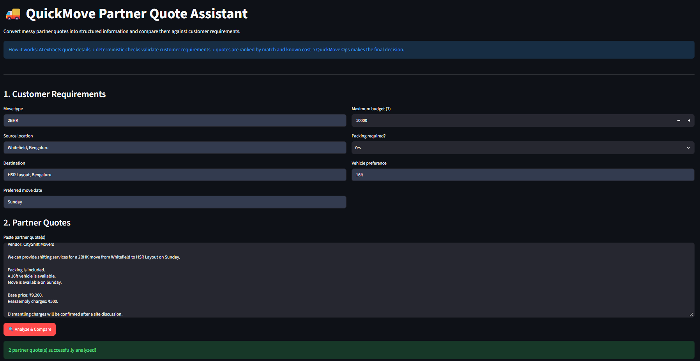
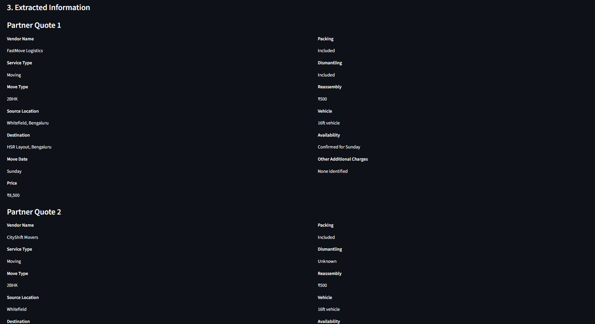
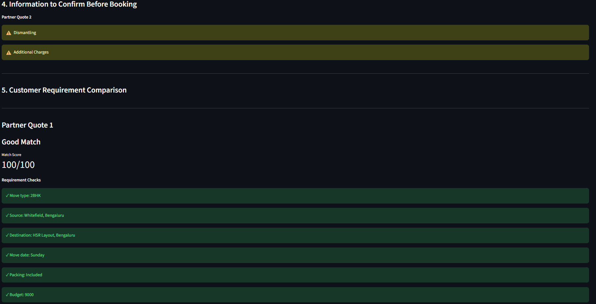
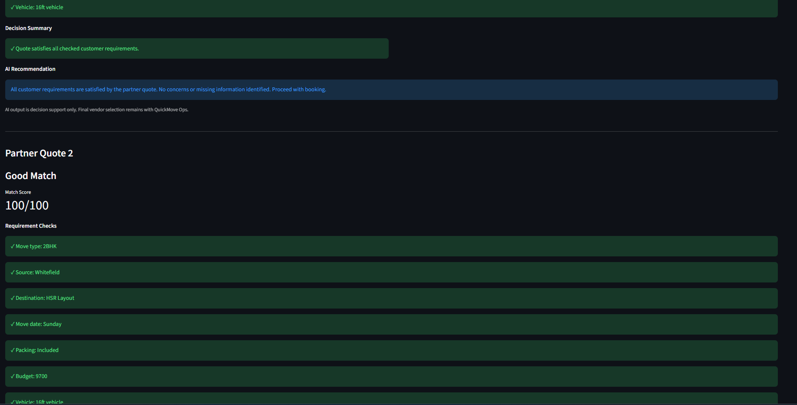
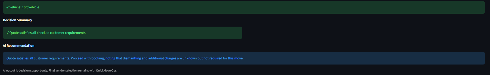
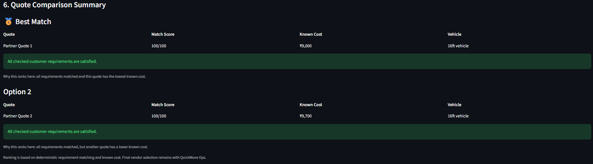

# QuickMove Partner Quote Assistant

An AI-assisted operations tool for QuickMove that converts messy moving-partner quotes into structured information and compares them against customer requirements.

## Problem

QuickMove operations teams receive partner information in unstructured formats such as WhatsApp messages, emails, and text.

Manually reading and comparing multiple partner quotes can lead to:

- Missing important information
- Inconsistent comparisons
- Budget or vehicle-size mistakes
- Time-consuming follow-ups
- Difficulty deciding which quote is the best fit

## Solution

The QuickMove Partner Quote Assistant helps operations teams analyze partner quotes in a consistent way.

The workflow is:

Partner quote(s)
→ AI extraction
→ Structured quote information
→ Deterministic requirement validation
→ Missing information detection
→ Quote comparison
→ Ranking
→ Human final decision

The system uses AI for extracting and interpreting unstructured partner messages, while deterministic Python checks are used for important requirement validation.

The final vendor selection remains with the QuickMove operations team.

## Features

- Extracts structured information from messy partner quotes
- Supports multiple partner quotes
- Detects missing information
- Compares quotes against customer requirements
- Validates:
  - Move type
  - Source location
  - Destination
  - Move date
  - Packing requirement
  - Maximum budget
  - Vehicle size
- Handles common location variations such as HSR and HSR Layout
- Calculates known cost from base price and explicitly stated reassembly cost
- Detects requirement mismatches
- Ranks multiple quotes
- Shows why a quote ranks higher or lower
- Keeps a human operator in the decision loop

## Screenshots

### 1. Main Interface

The operations user enters customer requirements and pastes one or more partner quotes.



### 2. Extracted Partner Information

The assistant converts unstructured partner messages into structured quote information and highlights information that needs to be confirmed.



### 3. Requirement Validation

Each partner quote is checked against the customer's requirements using deterministic validation.





### 4. Quote Comparison

Multiple partner quotes are ranked using requirement matching and known cost, helping the operations team identify the strongest option.


## Tech Stack Used

- Python 3.10.1
- Streamlit
- Groq API
- OpenAI GPT-OSS-20B
- python-dotenv

## Project Structure

```text
QuickMove/
│
├── app.py
├── screenshots
    ├── main-interface.png
    ├── extracted-information.png
    ├── requirement-validation1.png
    ├── requirement-validation2.png
    ├── requirement-validation3.png
    └── quote-comparison.png
├── requirements.txt
├── README.md
├── .env
└── .venv/